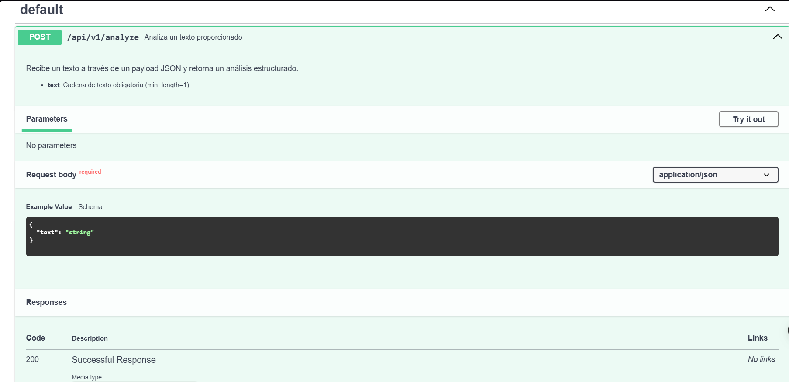
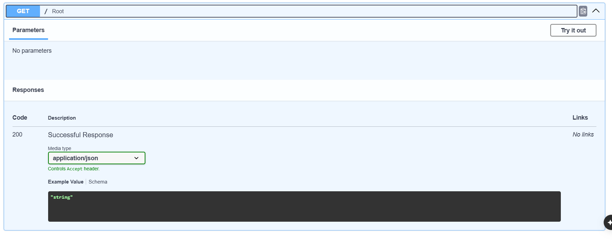
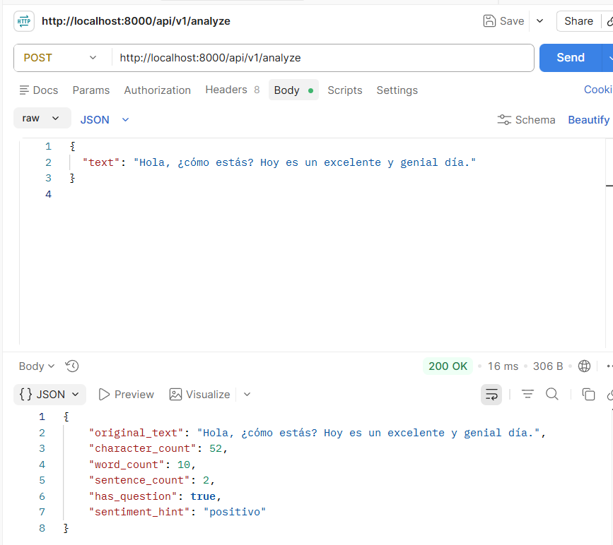
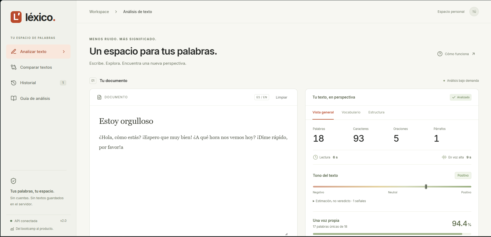
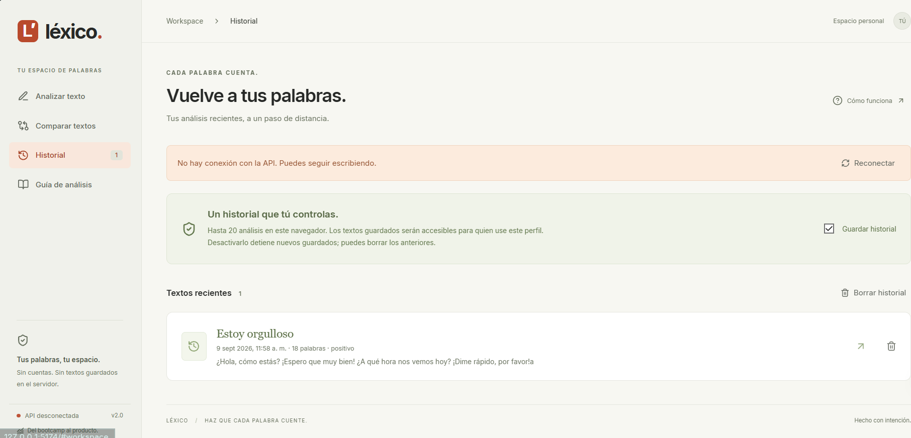

# KODIGO - FastAPI & Agent Skills Integration 🚀

**Autor:** Rodrigo Adrián Rosa Rivas

Este proyecto es la Actividad Individual del módulo de Diseño e Integración de Skills Agenticas. Consiste en una API básica desarrollada con **FastAPI** que cuenta con un endpoint para análisis de texto, junto con la integración de una **Skill Agentica** personalizada.

## Estructura del Proyecto

```text
ActFinalBootcamp/
├── app/
│   ├── api/
│   │   └── routes.py           # Endpoints de la API
│   ├── core/
│   │   └── config.py           # Configuración (Pydantic Settings)
│   ├── schemas/
│   │   └── text_analyzer.py    # Modelos de request y response
│   ├── services/
│   │   └── analyzer_service.py # Lógica pura de análisis de texto
│   └── main.py                 # Punto de entrada de FastAPI
├── .github/
│   └── skills/
│       └── text-analyzer-api/
│           └── SKILL.md        # Definición de la Agent Skill
├── requirements.txt            # Dependencias del proyecto
└── README.md                   # Documentación actual
```

## Funcionalidad de la API

La API expone el endpoint `POST /api/v1/analyze`, el cual recibe un objeto JSON con el campo `"text"` y responde con métricas obtenidas tras analizar el texto.

**Características Extraídas:**
- Longitud total de caracteres.
- Cantidad de palabras.
- Cantidad de oraciones.
- Detección de preguntas (`?`).
- Estimación del tono del sentimiento (`positivo`, `negativo` o `neutral`) buscando palabras clave.

## Propósito y Funcionamiento de la Skill

La skill `api-text-analyzer` (ubicada en `.github/skills/text-analyzer-api/SKILL.md`) fue creada utilizando el estándar de *Agent Skills* y YAML frontmatter.

**Propósito:**
Modificar el comportamiento autónomo del asistente de inteligencia artificial para que, en lugar de intentar realizar cálculos de lenguaje o conteo de palabras de forma estocástica y propensa a errores, delegue esta tarea matemática y lógica a la API local de FastAPI mediante el uso de herramientas de línea de comandos como `curl`.

**Cómo personaliza el comportamiento del agente:**
1. Al recibir un *prompt* pidiendo análisis de un texto, la Skill se activa semánticamente.
2. Instruye al agente para construir un Payload y realizar el llamado local a `http://localhost:8000/api/v1/analyze`.
3. Fuerza al agente a acatar la respuesta estricta devuelta por la API local, presentando la data de forma amistosa pero fiel a las métricas matemáticas (sin alucinaciones en el conteo de palabras).

## Cómo Desplegar y Probar Localmente

1. Crear y activar un entorno virtual (opcional pero recomendado):
   ```bash
   python -m venv venv
   source venv/bin/activate  # En Windows: venv\Scripts\activate
   ```

2. Instalar las dependencias:
   ```bash
   pip install -r requirements.txt
   ```

3. Levantar el servidor FastAPI:
   ```bash
   uvicorn app.main:app --reload
   ```

4. Probar la API de forma interactiva navegando a la documentación autogenerada:
   [http://localhost:8000/docs](http://localhost:8000/docs)

5. (Opcional) Probar el endpoint vía curl:
   ```bash
   curl -X 'POST' \
     'http://localhost:8000/api/v1/analyze' \
     -H 'accept: application/json' \
     -H 'Content-Type: application/json' \
     -d '{
     "text": "¿Hola cómo estás? Hoy es un excelente y genial día."
   }'
   ```

## Evidencia del Uso de IA

Este proyecto fue estructurado y generado con el soporte del entorno agentico *Antigravity* (impulsado por Gemini 3.1 Pro), el cual:
- Propuso la arquitectura separando `schemas`, `services` y `routes` para mantener el código modular y siguiendo buenas prácticas.
- Generó el archivo `.github/skills/text-analyzer-api/SKILL.md` garantizando un formato YAML de frontmatter válido para su fácil descubrimiento por el ecosistema de IA.
- Sirvió de par de programación, escribiendo y verificando cada archivo sin intervención manual.

## Evidencias (Capturas)

A continuación, se presentan las capturas de pantalla del funcionamiento:





### Nuevas Funcionalidades (Frontend y Backend Extendido)

El proyecto evolucionó para incluir una interfaz de usuario interactiva y nuevos endpoints. Aquí están las evidencias del funcionamiento actual:

**Análisis de Texto (Léxico y Métricas)**  
Se muestra la interfaz principal (`cap4`) procesando un texto. Muestra estadísticas instantáneas como el tiempo de lectura, diversidad léxica, cantidad de oraciones y el sentimiento heurístico.


**Comparación de Versiones**  
La herramienta permite contrastar dos textos (`cap5`), evidenciando el vocabulario compartido, la diferencia en cantidad de palabras y la fluctuación en la longitud promedio de las oraciones.


**Historial Local**  
El frontend gestiona un historial opt-in de hasta 20 análisis en el almacenamiento local del navegador (`cap6`), permitiendo revisar textos anteriores rápidamente.

