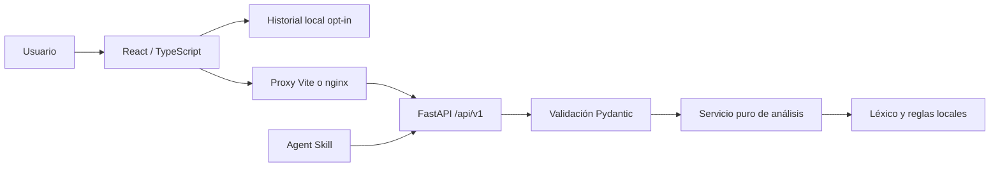

# Léxico: auditoría y arquitectura objetivo

## Fase 1 — Base auditada

Commit original: `533f284`. Repositorio limpio al comenzar. Se leyeron todos los
archivos de código, configuración, dependencias, README y Agent Skill.

La versión de bootcamp tiene cinco módulos Python: aplicación FastAPI, router,
schemas Pydantic, configuración y un servicio puro. Expone `POST /api/v1/analyze`
y una bienvenida en `/`. No tiene frontend, persistencia, tests ni CI.

Fortalezas: capas sencillas, servicio sin efectos secundarios, contrato explícito,
OpenAPI y una Skill que delega el conteo a la API en lugar de inventarlo.

Problemas: sentimiento por subcadenas; puntuación contada como palabras; blancos
aceptados; sin máximo de texto; CORS comodín con credenciales; excepciones internas
incluidas en respuestas; configuración Pydantic antigua; dependencias sin límite
superior; ausencia de pruebas, control del tamaño de peticiones y documentación
de limitaciones lingüísticas. No hay secretos en los archivos versionados revisados.

## Fase 2 — Producto y decisiones antes de implementar

**Léxico** es un taller de lectura y revisión de textos en español e inglés.
Su flujo principal: escribir o cargar un ejemplo → analizar explícitamente →
entender estructura, vocabulario y tono → editar → volver a analizar o comparar.

Pantallas: workspace, comparación de dos versiones, historial local y guía del
análisis. Sidebar compacta; editor central; resultados laterales en escritorio.
En móvil la navegación y las columnas se reorganizan en orden de lectura.
Identidad: papel cálido, tinta grafito, acento naranja quemado, gráficos simples,
tipografía de sistema y espacios editoriales. Sin fuentes ni trackers externos.

### Conservar / refactorizar / ampliar / reemplazar

- Conservar `app/`, `uvicorn app.main:app`, endpoint v1, seis campos originales,
  separación por capas, autoría y evidencia del bootcamp en Git y `docs/bootcamp`.
- Refactorizar schemas, configuración, tokenización, errores y CORS.
- Ampliar métricas, ejemplos, salud y comparación; tests, CI, Docker y documentación.
- Reemplazar el sentimiento por coincidencia de subcadenas con un léxico ponderado
  de palabras completas, alcance de negación e intensificación. Es una heurística
  transparente, no un clasificador de IA ni una medida de verdad emocional.

### Stack y límites

FastAPI + Pydantic; React + TypeScript + Vite; Lucide; CSS con tokens y SVG para
gráficos pequeños. Sin SSR, librería de gráficas, gestor global ni Query: son dos
operaciones explícitas, sin caché remota compartida ni necesidad de SEO de contenido.

API sin estado. Historial opt-in, máximo 20 textos en localStorage, eliminación
individual y total. Evita una base compartida sin autenticación y retención remota
de textos. Una futura sincronización requiere primero identidad y autorización.

Entradas de 1 a 50.000 caracteres con al menos una palabra. Límite de cuerpo de
700.000 bytes para aceptar dos textos con escape JSON. Sin texto en logs. CORS
con orígenes concretos. Producción mediante nginx como proxy de mismo origen.
TLS y límites globales de tráfico corresponden al ingreso del despliegue.

No se presenta una fórmula de legibilidad como validada: se muestran longitud de
oraciones, distribución y diversidad léxica con sus denominadores. Tiempos estimados
a 200 y 130 palabras/minuto. El servicio documenta límites con abreviaturas,
sarcasmo, idiomas no soportados y textos breves.

## Validación prevista

Pytest: contrato, métricas, negaciones, puntuación, Unicode, errores, CORS, límites
y comparación. Frontend: historial y exportación, interacción y manejo de fallos.
TypeScript, ESLint, build, Ruff y uso real del navegador en escritorio/móvil;
comprobación de teclado, estados, capturas y contraste. Evidencia final en QA.md.
